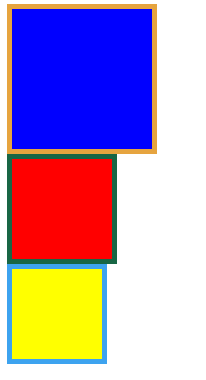

## css3 box-sizing属性

**box-sizing**属性可以为三个值之一：**content-box**（default），**border-box**，**padding-box**。

**content-box**，border和padding不计算入width之内

**padding-box**，padding计算入width内

**border-box**，border和padding计算入width之内，其实就是怪异模式了~

<br>

>IE8+浏览器支持content-box和border-box；<br>
>Firefox则支持全部三个值。<br>
>使用时：<br>
>```
>-webkit-box-sizing: 100px; /* for ios-safari, android */ 
>-moz-box-sizing:100px; /* for Firefox */
>box-sizing:100px; /* for other */
>```

例：<br>
```
<style type="text/css">
    .content-box{
        box-sizing:content-box;
        -moz-box-sizing:content-box;
        width: 100px;
        height: 100px;
        padding: 20px;
        border: 5px solid #E6A43F;
        background: blue;
    }
    .padding-box{
        box-sizing:padding-box;
        -moz-box-sizing:padding-box;
        width: 100px;
        height: 100px;
        padding: 20px;
        border: 5px solid #186645;
        background: red;                
    }
    .border-box{
        box-sizing:border-box;
        -moz-box-sizing:border-box;
        width: 100px;
        height: 100px;
        padding: 20px;
        border: 5px solid #3DA3EF;
        background: yellow;
    }
</style>
```


